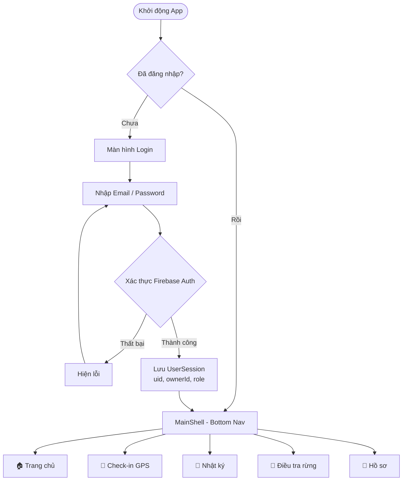
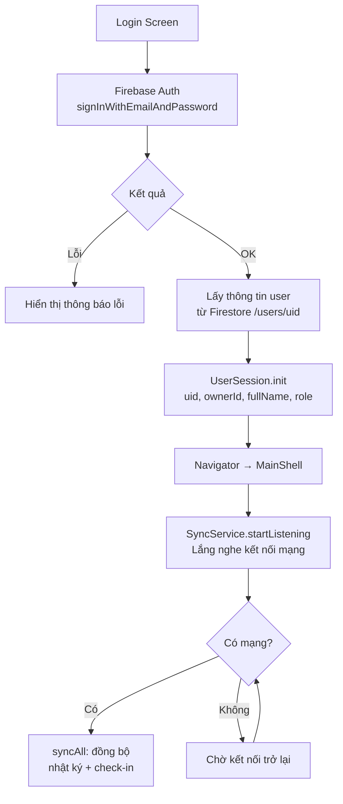
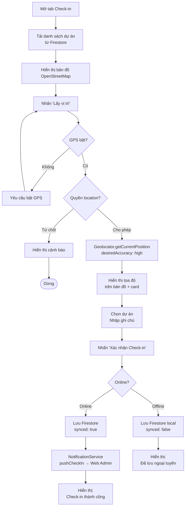
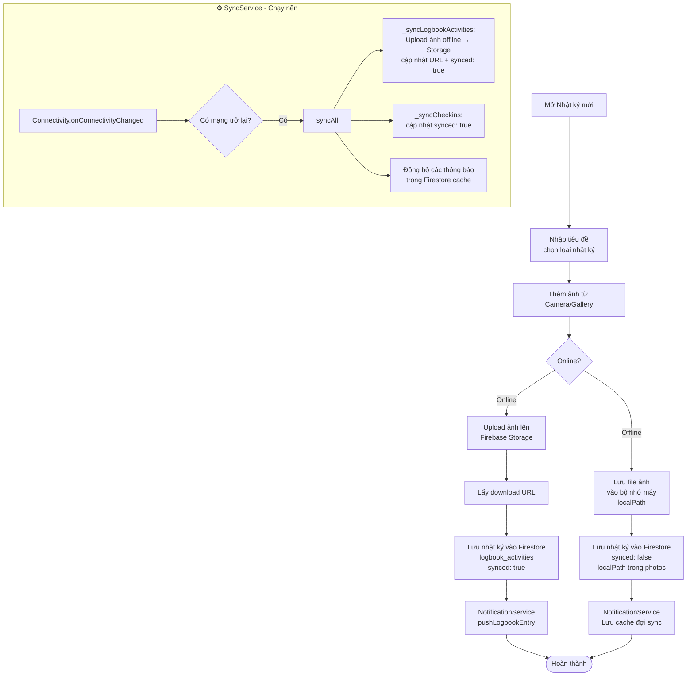
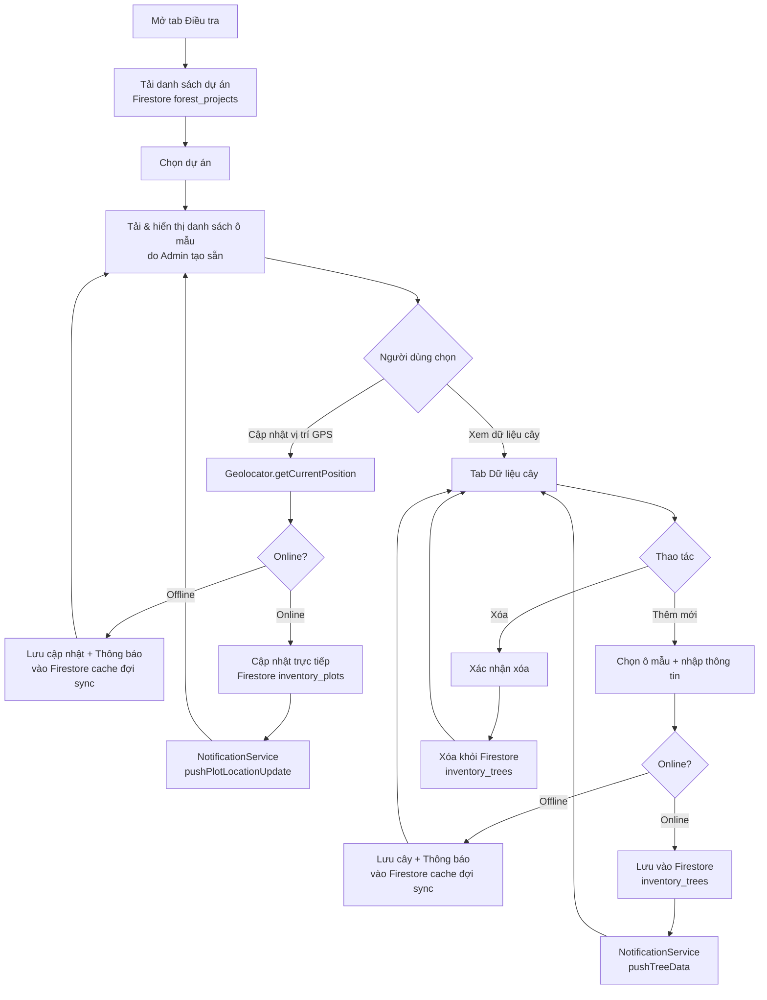
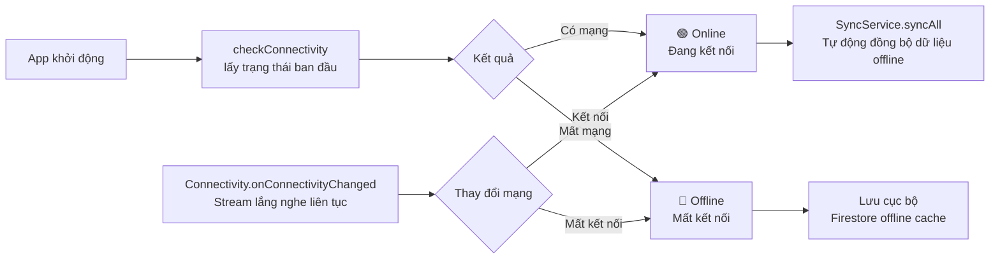

# 🌳 Forest Worker App - Flutter

Ứng dụng mobile cho nhân viên hiện trường trong hệ thống Forest Carbon Management Platform.

---

## 🗺️ Flowchart quy trình hoạt động

### 1. Luồng tổng quan hệ thống



### 2. Luồng xác thực & phiên làm việc



### 3. Luồng Check-in GPS



### 4. Luồng Nhật ký & Đồng bộ ảnh



### 5. Luồng Điều tra rừng



### 6. Luồng trạng thái Online / Offline



---

## 📱 Màn hình

| Màn hình | Chức năng |
|---|---|
| **Login** | Đăng nhập bằng email/password |
| **Home** | Dashboard: KPI, quick actions, hoạt động gần đây |
| **Check-in GPS** | Ghi nhận vị trí GPS + chọn dự án + ghi chú |
| **Nhật ký** | Danh sách nhật ký, lọc theo loại, thêm mới |
| **Điều tra rừng** | Ô mẫu (plots) + dữ liệu cây (DBH, chiều cao) |
| **Hồ sơ** | Thông tin cá nhân, dự án, cài đặt, đăng xuất |

---

## ⚙️ Cài đặt & Chạy

### Yêu cầu
- Flutter SDK >= 3.0.0 (https://docs.flutter.dev/get-started/install)
- Dart >= 3.0.0
- Android Studio / Xcode
- Android emulator hoặc iOS simulator (hoặc thiết bị thật)

### Bước 1: Clone / giải nén project

```bash
cd forest_worker_app
```

### Bước 2: Cài packages

```bash
flutter pub get
```

### Bước 3: Chạy app

```bash
# Android
flutter run

# iOS
flutter run -d ios
```

### Bước 4: Build APK

```bash
flutter build apk --release
# APK output: build/app/outputs/flutter-apk/app-release.apk
```

---

## 🗂️ Cấu trúc project

```
lib/
├── main.dart                    # App entry + AppTheme
├── firebase_options.dart        # Cấu hình Firebase
├── models/
│   └── models.dart              # Data models (LogbookEntry, CheckInRecord, ...)
├── screens/
│   ├── login_screen.dart        # Đăng nhập
│   ├── main_shell.dart          # Bottom navigation shell
│   ├── home_screen.dart         # Dashboard
│   ├── checkin_screen.dart      # Check-in GPS
│   ├── logbook_screen.dart      # Danh sách nhật ký
│   ├── new_logbook_screen.dart  # Tạo nhật ký mới
│   ├── inventory_screen.dart    # Điều tra rừng
│   └── profile_screen.dart      # Hồ sơ cá nhân
├── services/
│   ├── user_session.dart        # Singleton quản lý phiên đăng nhập
│   ├── sync_service.dart        # Đồng bộ dữ liệu offline → online
│   └── notification_service.dart# Gửi thông báo lên web admin
└── widgets/
    ├── stat_card.dart           # StatCard + SectionHeader
    ├── activity_tile.dart       # ActivityTile
    └── section_header.dart      # SectionHeader
```

---

## 🎨 Màu sắc

```dart
primary:      #1A4731  // Dark forest green
accent:       #52B788  // Medium green
accentLight:  #74C69D  // Light green
background:   #0F1C15  // Near-black green
cardBg:       #1E3027  // Card background
```

---

## 📡 Firebase Collections

| Collection | Mô tả |
|---|---|
| `users` | Thông tin người dùng (fullName, role, ownerId) |
| `forest_projects` | Dự án rừng (ownerUid, workerUids) |
| `forest_plots` | Ô mẫu điều tra (projectId) |
| `forest_trees` | Cây trong ô mẫu (plotId, DBH, height) |
| `logbook_activities` | Nhật ký hoạt động (user, photos, synced) |
| `checkins` | Bản ghi check-in GPS (createdBy, lat, lng, synced) |
| `notifications` | Thông báo từ admin (recipientIds, readBy) |

---

## 🔌 Tính năng Offline

App hỗ trợ offline mode hoàn chỉnh:
- Dữ liệu nhật ký & check-in lưu vào **Firestore offline cache** tự động
- Ảnh offline lưu vào **bộ nhớ máy** (`localPath`)
- **SyncService** tự động đồng bộ khi có mạng trở lại
- Indicator real-time hiển thị trạng thái **Online / Offline**

---

## 🗒️ TODO / Mở rộng

- [ ] Push notification (Firebase Cloud Messaging)
- [ ] Tính toán carbon sơ bộ
- [ ] Xuất báo cáo PDF
- [ ] Bộ lọc nâng cao cho nhật ký và điều tra
